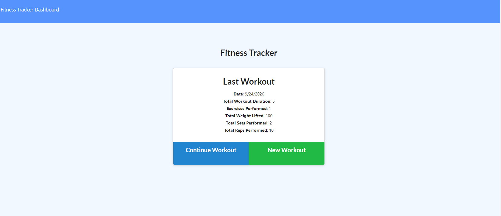

# Fitness Tracker

[](https://opensource.org/licenses/MIT)



## Description

As a user, I want to be able to view create and track daily workouts. I want to be able to log multiple exercises in a workout on a given day. I should also be able to track the name, type, weight, sets, reps, and duration of exercise. If the exercise is a cardio exercise, I should be able to track my distance traveled.

## Table of Contents

* [Installation](#installation)

* [Usage](#usage)

* [License](#license)

* [Contributing](#contributing)

* [Tests](#tests)

* [Questions](#questions)

## Installation

To install necessary dependencies, run the following command:

```
npm express & npm mongoose
```

## Usage

Currently closed

## License

This project is licensed under the MIT license

## Contributing

Not Accepting Contributions

## Tests

To run tests, run the following command:

```
N/A
```

## Questions

If you have any question about the repo, open an issue or contact me directly at patrick.j.mulhern1@gmail.com. You can find more of my work at pmulhern(https://github.com/pmulhern/).